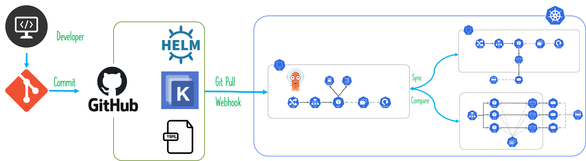

# What is GitOps

GitOps is a way to do Kubernetes cluster management and application delivery.  It works by using Git as a single source of truth for declarative infrastructure and applications. Accounting to [Weaveworks](https://www.weave.works/technologies/gitops/) the GitOps can be summarized as these two things:

- An operating model for Kubernetes and other cloud native technologies, providing a set of best practices that unify deployment, management and monitoring for containerized clusters and applications.
- A path towards a developer experience for managing applications; where end-to-end CICD pipelines and Git workflows are applied to both operations, and development.


## The next question pops up our mind Why GitOps? What benefit going to bring this? 

Listed 3 key important benefit Why GitOps? to learn about more refer to [GitOps.tech article](https://www.gitops.tech/#:~:text=GitOps%20is%20a%20way%20of,Git%20and%20Continuous%20Deployment%20tools.)

- What is unique about GitOps is that you don’t have to switch tools for deploying your application. Everything happens in the version control system you use for developing the application anyways.
- Your production environment is down! With GitOps you have a complete history of how your environment changed over time. This makes error recovery as easy as issuing a git revert and watching your environment being restored.
- GitOps allows you to manage deployments completely from inside your environment. For that, your environment only needs access to your repository and image registry. That’s it. You don’t have to give your developers direct access to the environment.

## What shall I use? Argo or Flux or Junkins X?” come up regularly. Here is my point of view

Let us look at [Flux](https://fluxcd.io/), the Flux installation is straight forward and easy you can install using based on [Helm Charts](https://docs.fluxcd.io/en/1.19.0/tutorials/get-started-helm/) and [Kustomize](https://docs.fluxcd.io/en/1.19.0/tutorials/get-started-kustomize/) the deployment of manifest happen true GitOps fashion the Flux pull changes from remote Git repo. If like to trigger changes manually you use fluxctl sycn to synchronization.

ArgoCD is installed as easy as Flux. The major difference is It runs on Kubernetes in its own namespace and all configuration is stored in ConfigMaps, Secrets, and Custom Resources. The benefit of this multi-tenancy (Assing project team to view application related to them) multi-cluster, auto detect the Git repo changes and notify on UI and dry run the changes before apply. 

Jenkins X is a complex and supports multi-tenancy, multi-cluster, build pipelines and ChatOps. I don’t go through the details of this tool and decided to focus on ArgoCD deployment. The reason is [Flux CD joins forces with Argo CD project](https://discuss.kubernetes.io/t/flux-cd-joins-forces-with-argo-cd-project/8678) and bringing bring a unified GitOps experience.



## Provision Azure Kubernetes Cluster

- Option 1 To deploy an AKS cluster using the Azure portal follow the steps in this article [Deploy an Azure Kubernetes Service (AKS) cluster using the Azure portal](https://docs.microsoft.com/en-us/azure/aks/kubernetes-walkthrough-portal)
- Option 2 [Baseline architecture for an Azure Kubernetes Service (AKS) cluster](https://docs.microsoft.com/en-us/azure/architecture/reference-architectures/containers/aks/secure-baseline-aks) To build a baseline infrastructure that deploys an Azure Kubernetes Service (AKS) cluster. This article includes recommendations for networking, security, identity, management, and monitoring of the cluster.
- Option 3 <Add Terraform Cluster provision here>


Here is the step to login cluster.

First, let's login to Kubernetes cluster via Azure CLI:

```Azure CLI
az login
```

Now let us ensure the our cluster information appear on the screen.
```Azure CLI
az aks list -o table
```


To get the credentials profile from your clusters issue following command 
```Azure CLI
az aks get-credentials -n <yourClusterName> -g <yourResourceGroupName>
````
my case example az aks get-credentials -n askramupcluster -g akscluster


Use kubectl config get-contexts you will be seeing all the clusters you where authenticated against, regardless of the azure subscription
```Kubectl
kubectl config get-contexts
```

My case I have 2 x cluster in different azure subscription, to switch profile I  need to use the context use below command to switch context between the clusters. 
```kubectl
kubectl config use-context <yourClusterName>
```
example kubectl config use-context askrumupcluster


# Setup GitOps with ArgoCD 

Now your cluster ready for GitOps setup. Let us focus on setting of GitOps using ArgoCD.

To setup ArgoCD you have two options, I am using Option 2 with terraform. 
## Option 1 User kubectl and provision. 
```kubectl
kubectl create namespace argocd
kubectl apply -n argocd -f https://raw.githubusercontent.com/argoproj/argo-cd/stable/manifests/install.yaml
```
## Option 2 Install and Configure ArgoCD via terraform (go to Argocd on my repo) 

Main.tf 
```terraform 
provider "kubernetes-alpha" {
  config_path = "~/.kube/config" // path to kubeconfig
}
module "argocd" {
  source    = "aareet/argocd/kubernetes"
  namespace = "argocd"
}
```
Here is the source [Github repo for ArgoCD terraform](https://github.com/aareet/terraform-kubernetes-argocd) 

By default, the Argo CD API server is not exposed with an external IP. To access the API server, choose one of the following techniques to expose the Argo CD API server:

Change the argocd-server service type to LoadBalancer:
```kubectl
kubectl patch svc argocd-server -n argocd -p '{"spec": {"type": "LoadBalancer"}}'
```
To get Public IP address of ArgoCD server

```kubectl
kubectl get svc -A 
```

This command will list all the services running under ASK cluster and look for External IP 


Kubectl port-forwarding can also be used to connect to the API server without exposing the service.

``` kubectl
kubectl port-forward svc/argocd-server -n argocd 8080:443
```
The API server can then be accessed using the localhost:8080


Goto browser and typee localhost:8080


The initial password is autogenerated to be the pod name of the Argo CD API server. This can be retrieved with the command
``` kubectl 
kubectl get pods -n argocd -l app.kubernetes.io/name=argocd-server -o name | cut -d'/' -f 2
```
Now you need password to login to the server, the default user name is admin. The password for the Argo CD is hostname of the service. To get host name issue following 


