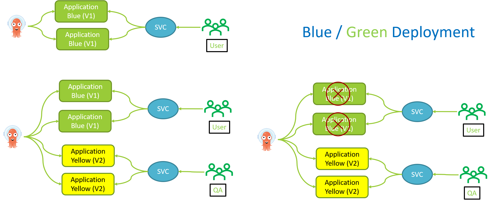

# Kubernetes Deployment Strategies

This article focuses on Kubernetes different deployment strategies and how to achieve them. We will also focus on the pros and cons of different deployment strategies.
There are several different types of deployment strategies you can take advantage of depending on your organization / application requirements goal.

RollingUpdate is the default strategy where Kubernetes creates a new ReplicaSet and starts scaling the new ReplicaSet up and simultaneously scaling the old ReplicaSet down. These strategy faces few limitation Inability to control traffic flow to the new version, Proper management of deployment images ensures rollback to any version without much of a fuzz, More features are can be deployed in production in less time.

kubectl create namespace argo-rollouts

kubectl apply -n argo-rollouts -f https://raw.githubusercontent.com/argoproj/argo-rollouts/stable/manifests/install.yaml

curl -LO https://github.com/argoproj/argo-rollouts/releases/latest/download/kubectl-argo-rollouts-linux-amd64

chmod +x ./kubectl-argo-rollouts-linux-amd64

sudo mv ./kubectl-argo-rollouts-linux-amd64 /usr/local/bin/kubectl-argo-rollouts

kubectl argo rollouts version

Agro CD Deploy

kubectl argo rollouts get rollout rollouts-demo --watch

kubectl port-forward svc/rollouts-demo 8080:80


kubectl argo rollouts abort rollouts-demo


Canary Rollout 


kubectl argo rollouts get rollout rollouts-demo-canary --watch 


kubectl port-forward svc/rollouts-demo-canary 8080:80

## Blue Green Deployement 
In a blue/green deployment strategy (sometimes referred to as red/black) the old version of the application (green) and the new version (blue) get deployed at the same time. When both of these are deployed, users only have access to the green; whereas, the blue is available to your QA team for test automation on a separate service or via direct port-forwarding.


## To watch Blue Green deployment 
```kube
kubectl argo rollouts get rollout rollout-bluegreen --watch
```

## Port forwaring for User and QA
``kube
kubectl port-forward svc/rollout-bluegreen-active 8082:80
kubectl port-forward svc/rollout-bluegreen-preview 8083:80
```